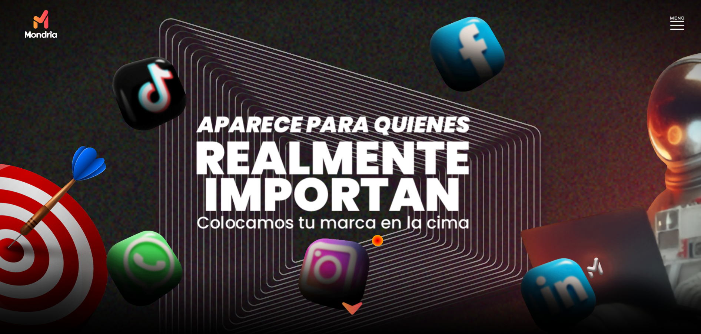
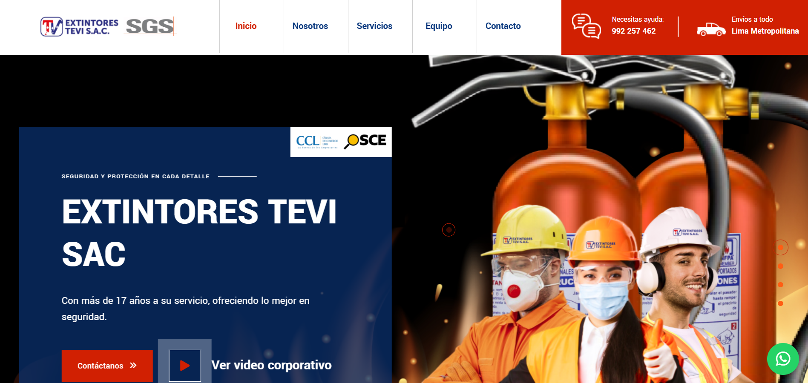
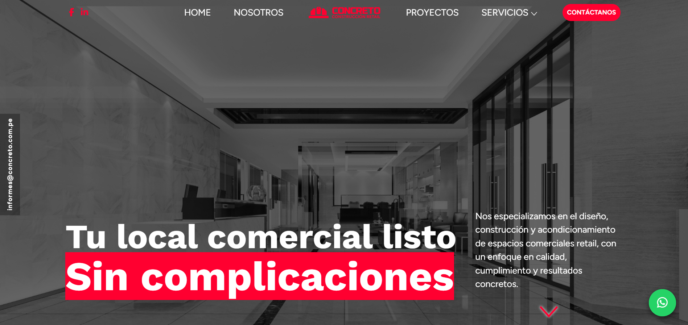
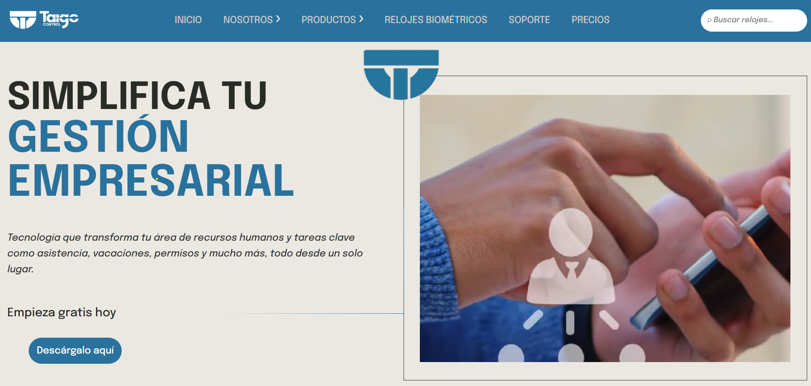
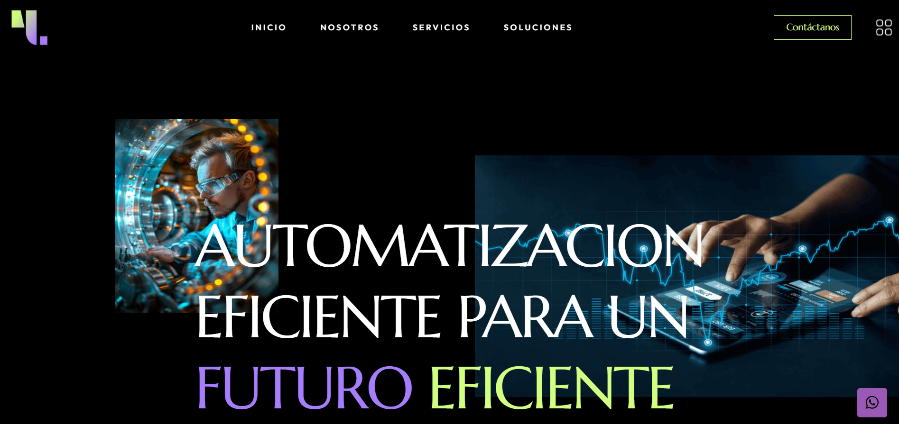
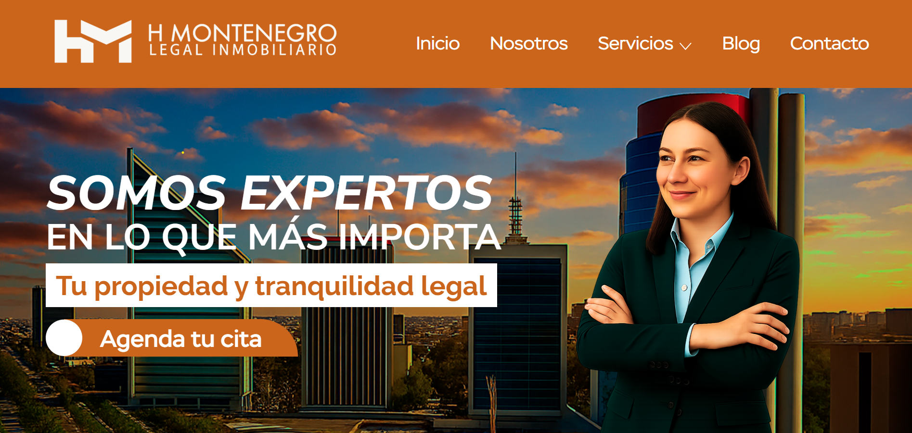
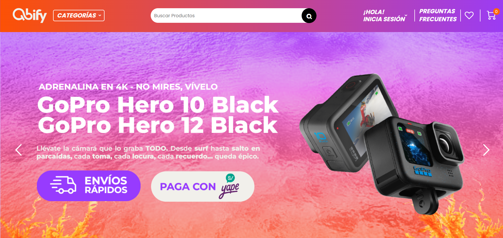

# 🌐 Portafolio de Sitios Web

Este repositorio reúne algunos de los sitios web que he desarrollado.  
Cada proyecto incluye un **link en línea** y **capturas de pantalla** como respaldo visual.

---

## 🚀 Proyectos

### 1. Mondria Digital - Corporativo
🔗 [Ver sitio en línea](https://www.mondriadigital.pe/)  

---

### 2. TeviPeru - Corporativo
🔗 [Ver sitio en línea](https://teviperu.com/)  
📌 **Web Corporativa desarrollada en WordPress**  

---

### 3. Concreto - Corporativo
🔗 [Ver sitio en línea](https://www.concreto.com.pe/)  

---

### 4. TaigoControl - Corporativo
🔗 [Ver sitio en línea](www.t4g.com.pe)  

---

### 5. T4G - Corporativo
🔗 [Ver sitio en línea](https://www.t4g.com.pe/)  

---

### 6. HM INMOBILIARIA - Corporativo
🔗 [Ver sitio en línea](https://www.hminmobiliaria.com.pe/)  

---

### 7. Qbify - E-comerce
🔗 [Ver tienda en línea] *(en construcción)*  
📌 **E-commerce desarrollado en WordPress con WooCommerce**  

